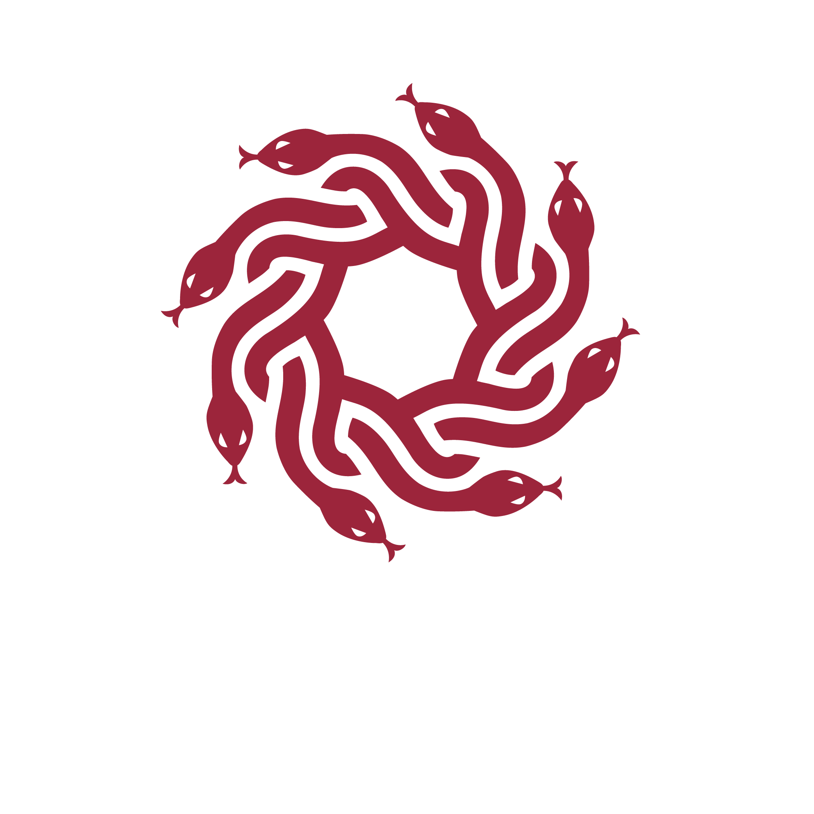

`medusa` is a cross-platform go-ethereum-based smart contract fuzzer inspired by Echidna. It provides parallelized fuzz
testing of smart contracts through CLI, or its Go API that allows custom user-extended testing methodology.

## Table of Contents

- [Getting Started](./getting_started/installation.md): Learn how to install `medusa` and how to set it up for your first project.
- [Project Configuration](./project_configuration/overview.md): Learn how to set up `medusa` for your project as well as
  the vast number of configuration options that can be set up based on your project needs.
- [Command Line Interface](./cli/overview.md): Learn how to use `medusa`'s CLI.
- [Writing Tests](./testing/overview.md): Learn how to write tests with `medusa`
- [API (WIP)](./api/api_overview.md): Learn about `medusa`'s Go API that can be used to perform advanced testing
  methodologies and extend `medusa`'s capabilities.
- Appendices
  - [Cheatcodes](./cheatcodes/cheatcodes_overview.md): Learn about the various cheatcodes that are supported by `medusa`.
  - [Console Logging](./console_logging.md): Learn about how to use `console.log` with `medusa`.
  - [FAQ](./faq.md)
