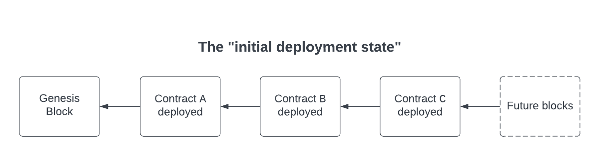

# The Fuzzing Lifecycle

Understanding what `medusa` is doing under-the-hood significantly aids in understanding how to fuzz smart contracts
and also in writing fuzz tests. This chapter will walk you through the process of deploying the target contracts,
generating and executing call sequences, using the corpus, updating coverage, and resetting the blockchain.

## Contract deployment

The contract deployment process will deploy each contract specified in the
[`fuzzing.targetContracts`](../project_configuration/fuzzing_config.md#targetcontracts) one-by-one. Any contracts that
are dynamically deployed during the _construction_ of a target contract are also deployed. The deployment of these
contracts are done by the configurable
[`fuzzing.deployerAddress`](../project_configuration/fuzzing_config.md#deployeraddress) address.

We will call the state of the blockchain after all the target contracts are deployed as the **"initial deployment state"**.
This is the state of the blockchain before any transactions have been executed by the fuzzer. Here is what the underlying
blockchain would look like after the deployment of contracts `A`, `B`, `C` (assuming no other dynamic deployments).



Now that we have our target contracts deployed, we can start executing call sequences!

## Call sequence execution

Call sequence execution is the crux of the fuzzing lifecycle. At a high-level, call sequence execution is the **iterative
process of executing fuzzed transactions on the initial deployment state** in hopes of violating (or validating) an invariant.
Before continuing, it is important to understand what a call sequence is.

### Defining a call sequence

A call sequence is an **array of individual transactions**. The length of the array is governed by the
[`fuzzing.callSequenceLength`](../project_configuration/fuzzing_config.md#callsequencelength) configuration parameter.
The fuzzer will maintain EVM state for the duration of a call sequence before [resetting the state](#resetting-the-blockchain).
Thus, if you have a call sequence length of 10, `medusa` will execute 10 transactions, maintain state throughout that
process, and then wipe the EVM state. Having a call sequence length of 1 means that `medusa` will wipe the state after
each transaction. This is useful for fuzz testing arithmetic libraries or isolated functions.

Now that you know what a call sequence is, let's discuss how to generate a call sequence.

### Generating a call sequence

Call sequence generation can happen in two main ways:

1. Generate a completely random call sequence
2. Mutate an existing call sequence from the corpus

Let's talk about each possibility. Generating a completely random call sequence is straightforward. If we have a
`fuzzing.callSequenceLength` of 50, we will generate 50 random transactions.

> **Definition**: A random transaction is a call to a random method in one of the target contracts. Any input arguments
> to the method are fuzzed values.

The second possibility is more nuanced. To understand how to mutate an existing call sequence from the corpus, we need
to first discuss the idea of coverage and what a corpus is.

### Coverage and the corpus

Tracking coverage is one of the most powerful features of `medusa`.

> **Definition**: Coverage is a measure of what parts of the code have been executed by the fuzzer

Coverage is tracked in a rather simple fashion. For each target contract, we maintain a byte array where the length of the
byte array is equal to the length of that contract's bytecode. If a certain transaction caused us to execute an opcode
that we had not executed before, we increased coverage of that contract.


As shown in the figure above, the `CALL` opcode was just executed causing the coverage array's value to be updated at that
index. The next natural question is, how do we harness this information to improve the fuzzer?

This is where the idea of a **corpus** comes in.

> **Definition**: The corpus is a structure that holds "interesting" or "coverage-increasing" call sequences.

Thus, when `medusa` runs, if it finds a call sequence that increased its coverage of the system, it will add it to the corpus.
These call sequences are invaluable to `medusa` because they allowed it to explore a larger portion of the system. This is
what makes `medusa` a **coverage-guided fuzzer**.

> **Definition**: A coverage-guided fuzzer is one that aims to maximize its coverage of the system.

Tracking coverage and storing coverage-increasing sequences in the corpus also allows `medusa` to re-use these sequences.
This takes us back to the second possibility when generating call sequences: mutating an existing sequence from the corpus.

The reason we re-use call sequences is that we know that the call sequence in question improved our coverage. So, we
might as well re-use it, **mutate** it, and then execute that mutated call sequence in hopes of further increasing our coverage.
There are a variety of mutational strategies that `medusa` employs. For example, `medusa` can take a call sequence from the corpus and append a new random
transaction at the end of it. This is called **mutational fuzzing**.

> **Definition**: Mutational fuzzing is the practice of taking existing data samples and generating new variants of them
> (mutants).

Now that we know what a call sequence is, how to generate them, and how to track coverage, we can finally discuss how
these call sequences are executed.

### Executing the call sequence

Call sequence execution happens in an _iterative_ fashion. Here is some pseudocode on how it happens:

```
# Generate a new call sequence or mutate one from the corpus
sequence = generator.NewCallSequence()

# Iteratively execute each call in the call sequence
for i < len(sequence) {
    # Retrieve the i-th element in the sequence
    tx = sequence[i]

    # Run the transaction on the blockchain and retrieve the result
    result = blockchain.executeTransaction(tx)

    # Update coverage
    increasedCoverage = coverageTracker.updateCoverage()

    # If coverage increased, add sequence[:i+1] to the corpus
    if increasedCoveraged {
        corpus.addCallSequence(tx[:i+1])
    }

    # Check for invariant failures
    encounteredFailure = tester.checkForInvariantFailures(result)

    # Let user know we had a failing test case
    if encounteredFailure {
        reportFailedTestCase()
    }
}
```

The one portion of the above pseudocode that we did not discuss is checking for invariant failures. We will discuss
the different types of invariants and what an invariant failure means in the [next chapter](./invariants.md).

## Resetting the blockchain

The final step in the fuzzing lifecycle is resetting the blockchain. Resetting the blockchain is as simple as reverting
to the "initial deployment state" of the blockchain. Once we reset back to the "initial deployment state", we can now generate and execute
another call sequence!
